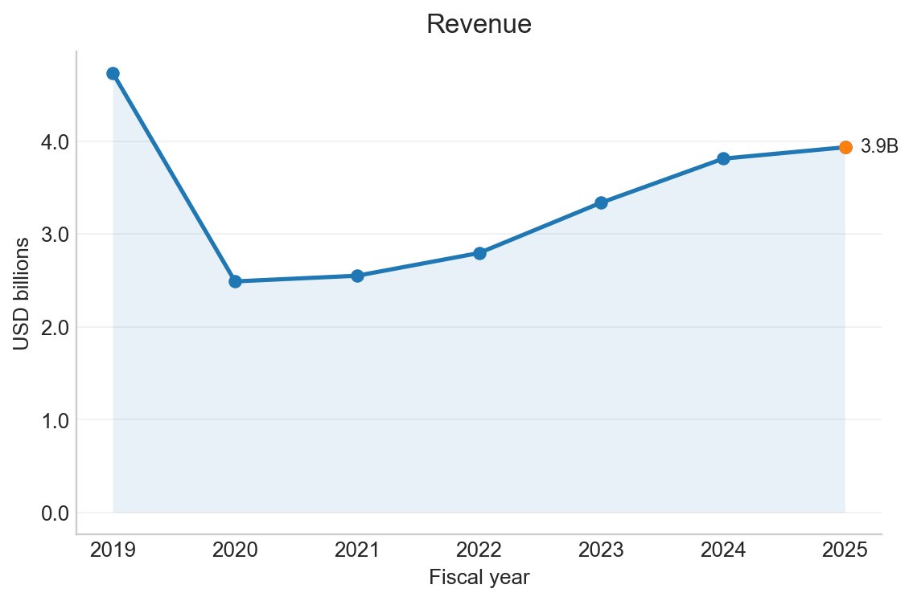
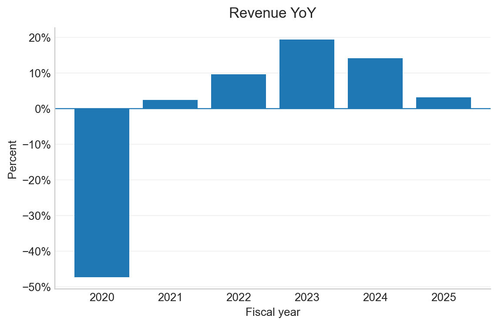
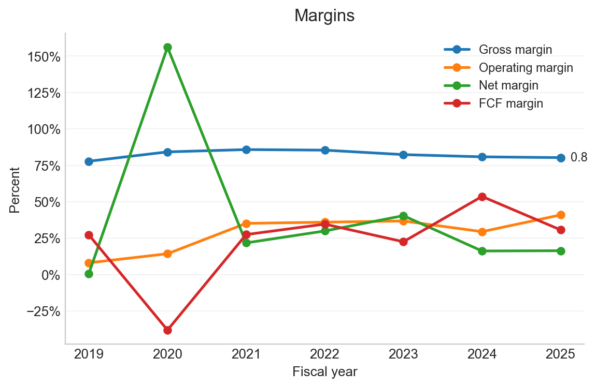
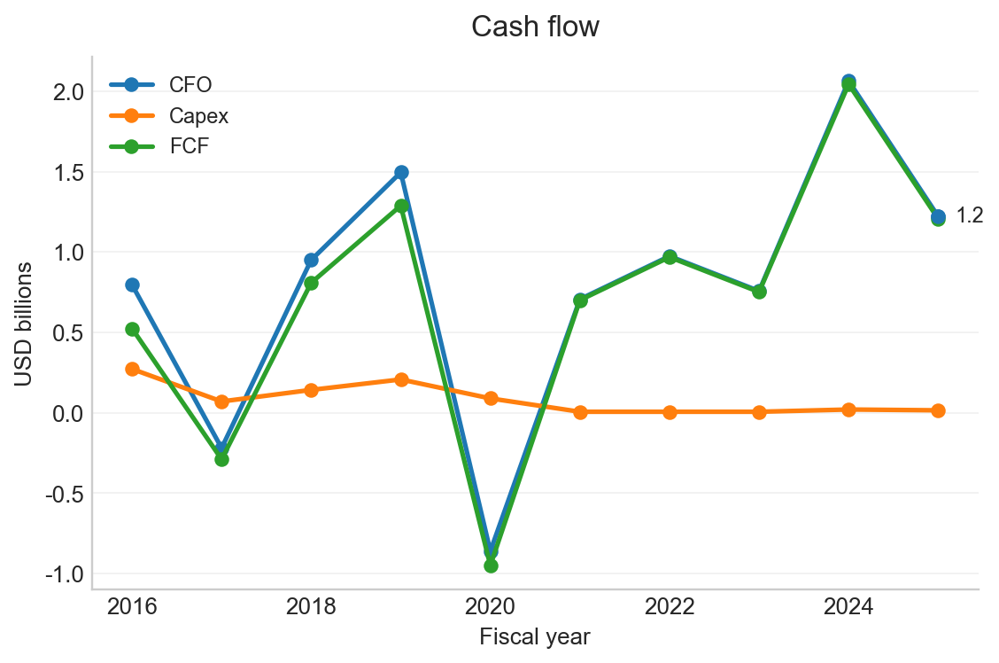
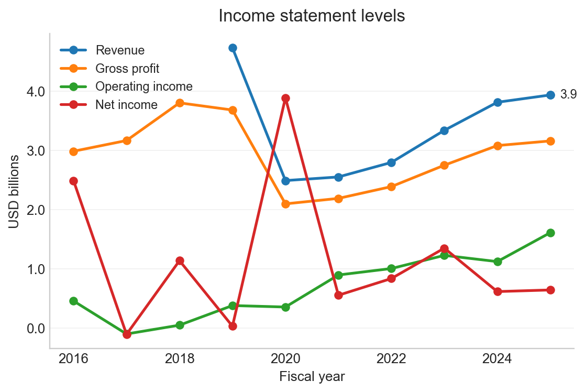
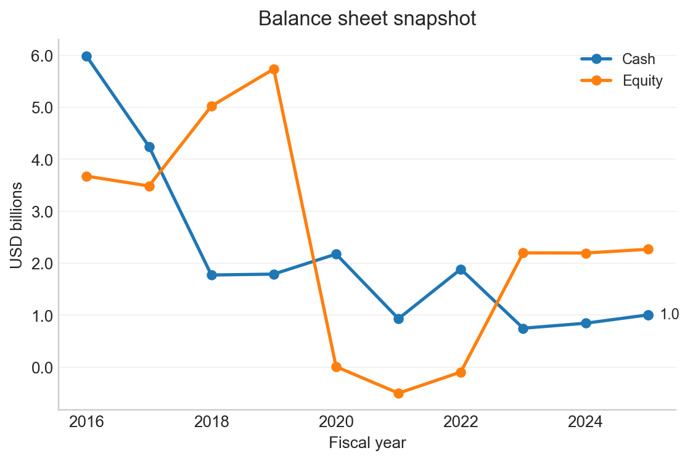
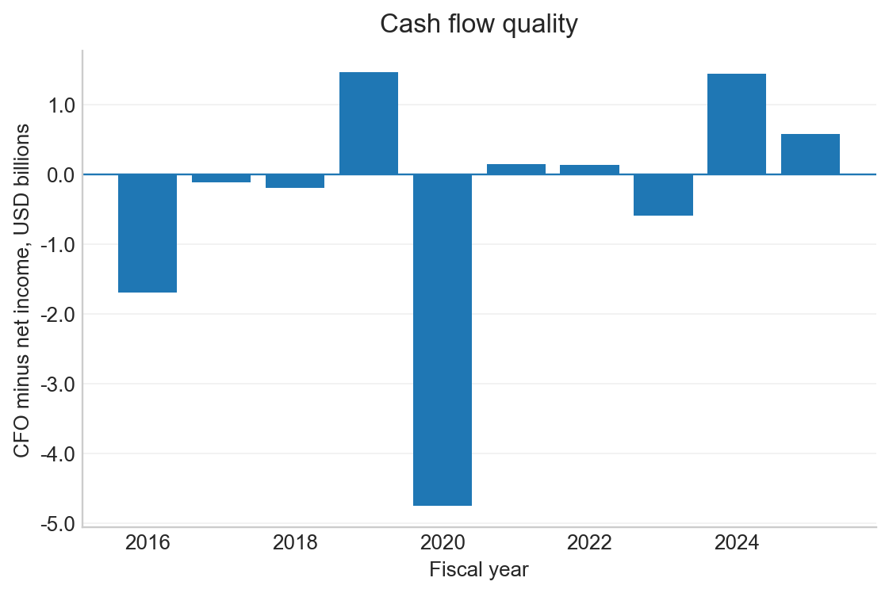
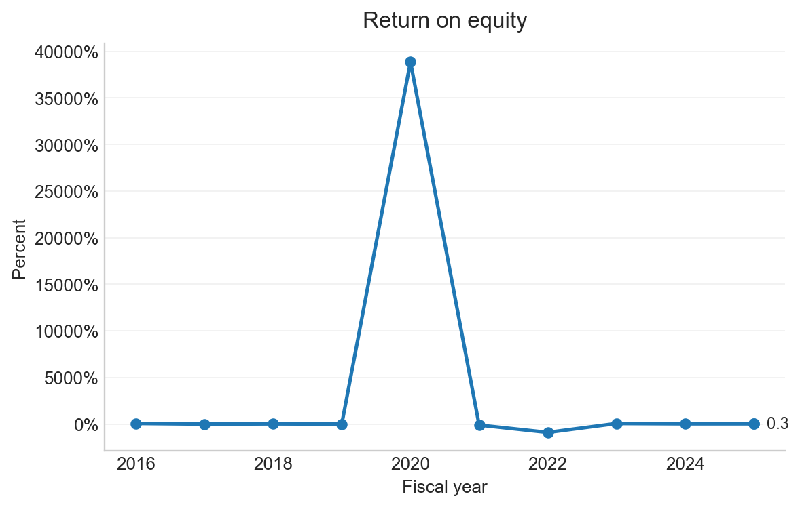

# Gen Digital Inc. - GEN Automated Financial Analysis Report

- CIK: `0000849399`
- Generated: 2026-02-22 21:57:17
- Coverage: last 10 fiscal years

## Highlights
- Latest fiscal year: **FY2025** ended 2025-03-28.
- Revenue: **3.9B** and 3.2% YoY.
- Gross margin: **80.3%**.
- Operating margin: **40.9%**.
- Net margin: **16.3%**.
- Free cash flow: **1.2B** and 30.6% of revenue.
- Revenue increased vs prior year.

## Charts

| | |
|---|---|
| <b>Revenue</b>  | <b>Revenue YoY</b>  |
| <b>Margins</b>  | <b>Cash flow</b>  |
| <b>Income statement levels</b>  | <b>Balance sheet snapshot</b>  |
| <b>Cash flow quality</b>  | <b>Return on equity</b>  |

## Annual Financials Table
USD in billions for level metrics
|   fy | fiscal_year_end   | revenue   |   gross_profit |   operating_income |   net_income |   cfo |   capex |   fcf | revenue_yoy   | gross_margin   | operating_margin   | net_margin   | fcf_margin   |   cash |   equity |
|-----:|:------------------|:----------|---------------:|-------------------:|-------------:|------:|--------:|------:|:--------------|:---------------|:-------------------|:-------------|:-------------|-------:|---------:|
| 2025 | 2025-03-28        | 3.9       |            3.2 |                1.6 |          0.6 |   1.2 |     0   |   1.2 | 3.2%          | 80.3%          | 40.9%              | 16.3%        | 30.6%        |    1   |      2.3 |
| 2024 | 2024-03-29        | 3.8       |            3.1 |                1.1 |          0.6 |   2.1 |     0   |   2   | 14.2%         | 80.8%          | 29.4%              | 16.2%        | 53.6%        |    0.8 |      2.2 |
| 2023 | 2023-03-31        | 3.3       |            2.7 |                1.2 |          1.3 |   0.8 |     0   |   0.8 | 19.4%         | 82.4%          | 36.8%              | 40.4%        | 22.5%        |    0.8 |      2.2 |
| 2022 | 2022-04-01        | 2.8       |            2.4 |                1   |          0.8 |   1   |     0   |   1   | 9.6%          | 85.4%          | 35.9%              | 29.9%        | 34.6%        |    1.9 |     -0.1 |
| 2021 | 2021-04-02        | 2.6       |            2.2 |                0.9 |          0.6 |   0.7 |     0   |   0.7 | 2.4%          | 85.8%          | 35.1%              | 21.7%        | 27.4%        |    0.9 |     -0.5 |
| 2020 | 2020-04-03        | 2.5       |            2.1 |                0.4 |          3.9 |  -0.9 |     0.1 |  -0.9 | -47.4%        | 84.2%          | 14.3%              | 156.1%       | -38.2%       |    2.2 |      0   |
| 2019 | 2019-03-29        | 4.7       |            3.7 |                0.4 |          0   |   1.5 |     0.2 |   1.3 | NA            | 77.8%          | 8.0%               | 0.7%         | 27.2%        |    1.8 |      5.7 |
| 2018 | 2018-03-30        | NA        |            3.8 |                0   |          1.1 |   0.9 |     0.1 |   0.8 | NA            | NA             | NA                 | NA           | NA           |    1.8 |      5   |
| 2017 | 2017-03-31        | NA        |            3.2 |               -0.1 |         -0.1 |  -0.2 |     0.1 |  -0.3 | NA            | NA             | NA                 | NA           | NA           |    4.2 |      3.5 |
| 2016 | 2016-04-01        | NA        |            3   |                0.5 |          2.5 |   0.8 |     0.3 |   0.5 | NA            | NA             | NA                 | NA           | NA           |    6   |      3.7 |

## XBRL Concept Map

| Metric | XBRL Concept |
|---|---|
| revenue | `RevenueFromContractWithCustomerExcludingAssessedTax` |
| gross_profit | `GrossProfit` |
| operating_income | `OperatingIncomeLoss` |
| net_income | `NetIncomeLoss` |
| cfo | `NetCashProvidedByUsedInOperatingActivities` |
| capex | `PaymentsToAcquirePropertyPlantAndEquipment` |
| cash | `CashAndCashEquivalentsAtCarryingValue` |
| equity | `StockholdersEquity` |
